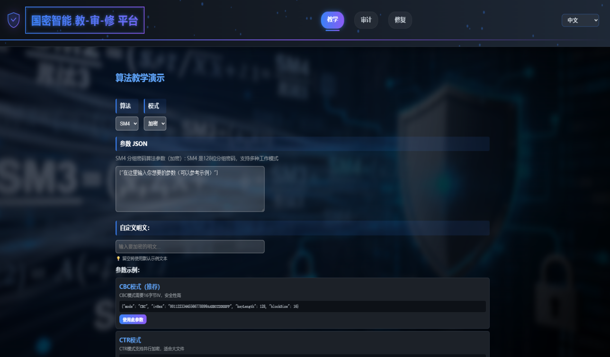
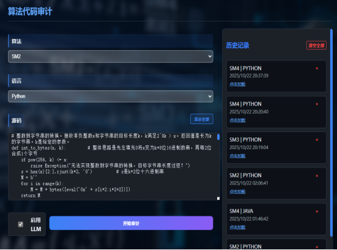
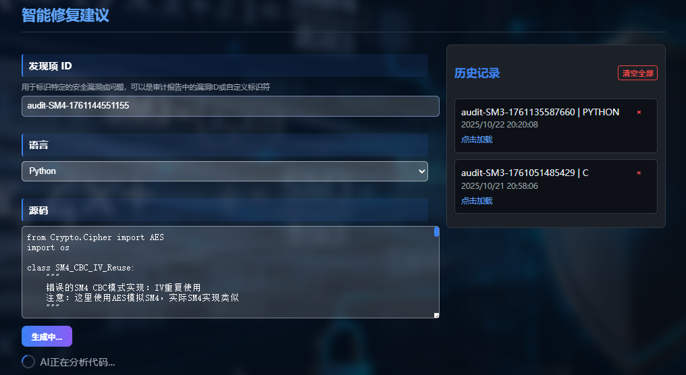

# 基于大模型的国密算法智能教学和智能化代码安全审计及辅助修复系统

## 项目简介

基于大模型的国密算法智能教学和智能化代码安全审计及辅助修复系统是一个基于React + FastAPI的智能国密算法学习与安全审计系统，集成了教学演示、代码审计、智能修复三大核心功能。系统采用现代化的Web技术栈，为用户提供直观的国密算法学习体验和专业的代码安全审计服务。

## 技术栈

### 前端技术
* **核心框架**: React 18.3.1 + TypeScript 5.6.2
* **构建工具**: Vite 5.4.8
* **路由管理**: React Router DOM 6.27.0
* **国际化**: React i18next 14.1.2
* **HTTP客户端**: Axios 1.7.7
* **样式方案**: CSS3 + 响应式设计

### 后端技术
* **核心框架**: FastAPI + Python 3.8+
* **数据库**: MySQL 5.7+ / 8.0+ (SQLAlchemy ORM)
* **国密算法**: gmssl库（SM2/SM3/SM4）
* **AI集成**: DeepSeek API
* **数据验证**: Pydantic
* **密码加密**: Passlib (bcrypt)
* **跨域支持**: CORS Middleware

### 开发工具
* **包管理**: npm/yarn
* **代码规范**: ESLint + Prettier
* **版本控制**: Git
* **容器化**: Docker（可选）

## 功能特点

### 🎓 国密算法教学模块



* **SM2椭圆曲线算法**：数字签名、密钥交换、加密解密
* **SM3密码杂凑算法**：哈希计算、消息摘要、完整性验证
* **SM4分组密码算法**：CBC/ECB/CTR模式加密解密
* **可视化演示**：分步骤展示算法执行过程
* **参数自定义**：支持用户自定义输入和参数配置
* **实时计算**：使用真实国密算法库进行计算

### 🔍 智能代码审计模块



* **多语言支持**：Python、Java、C/C++、JavaScript、TypeScript、Go
* **规则引擎**：基于国密规范的智能检测规则
* **漏洞检测**：
  - 硬编码密钥检测
  - IV复用检测
  - 不安全随机数检测
  - ECB模式使用检测
  - 密钥生成随机性检测
* **AI增强**：集成DeepSeek大模型进行智能分析
* **历史记录**：审计历史保存和快速加载

### 🔧 智能修复建议模块



* **智能分析**：基于代码结构分析生成修复建议
* **LLM增强**：可选的大模型增强修复建议
* **多语言修复**：支持多种编程语言的修复代码生成
* **详细指导**：提供漏洞定位、原因分析、修复建议
* **代码示例**：生成完整的修复后代码示例

## 系统架构

```
GM Teach-Audit-Fix/
├── web-frontend/          # React前端应用
│   ├── src/
│   │   ├── pages/         # 页面组件
│   │   │   ├── Teach.tsx  # 教学模块
│   │   │   ├── Audit.tsx  # 审计模块
│   │   │   └── Fix.tsx    # 修复模块
│   │   ├── main.tsx       # 应用入口
│   │   └── i18n.ts        # 国际化配置
│   ├── package.json       # 依赖配置
│   └── vite.config.ts     # 构建配置
├── python-service/         # FastAPI后端服务
│   ├── app/
│   │   ├── routers/       # API路由
│   │   │   ├── teach.py   # 教学API
│   │   │   ├── audit.py   # 审计API
│   │   │   └── fix.py     # 修复API
│   │   ├── models.py      # 数据模型
│   │   ├── rules.py       # 审计规则
│   │   └── llm_client.py  # LLM客户端
│   └── requirements.txt      # Python依赖
└── sql/                    # 数据库脚本
    └── create_table.sql    # 建表脚本
```

## 安装与运行

### 环境要求

* **Node.js**: 16.0+
* **Python**: 3.8+
* **npm/yarn**: 最新版本
* **MySQL**: 5.7+ 或 8.0+（推荐 8.0+）

### 前端启动

1. 进入前端目录
```bash
cd web-frontend
```

2. 安装依赖
```bash
npm install
# 或
yarn install
```

3. 启动开发服务器
```bash
npm run dev
# 或
yarn dev
```

访问 `http://localhost:5173` 查看前端应用

### 后端启动

1. 进入后端目录
```bash
cd python-service
```

2. 安装依赖
```bash
pip install -r requirements.txt
```
3. 配置MySQL数据库

首先确保MySQL服务已启动，然后创建数据库：

**方式一：使用SQL脚本（推荐）**
```bash
# 在MySQL客户端中执行
mysql -u root -p < sql/create_table.sql
```

**方式二：使用Python初始化脚本**
```bash
# 配置数据库环境变量后运行
python -m app.init_db
```

4. 配置环境变量
```bash
# Windows PowerShell
# 数据库配置
$env:DB_HOST="localhost"
$env:DB_PORT="3306"
$env:DB_USER="root"
$env:DB_PASSWORD="你的MySQL密码"
$env:DB_NAME="sm_platform"

# LLM配置（可选）
$env:LLM_API_KEY="你的DeepSeek_API_Key"
$env:LLM_BASE_URL="https://api.deepseek.com"
$env:LLM_MODEL="deepseek-chat"

# 认证配置（可选）
$env:AUTH_SECRET_KEY="你的JWT密钥"
$env:ACCESS_TOKEN_EXPIRE_MINUTES="120"

# Linux/Mac
# 数据库配置
export DB_HOST="localhost"
export DB_PORT="3306"
export DB_USER="root"
export DB_PASSWORD="你的MySQL密码"
export DB_NAME="sm_platform"

# LLM配置（可选）
export LLM_API_KEY="你的DeepSeek_API_Key"
export LLM_BASE_URL="https://api.deepseek.com"
export LLM_MODEL="deepseek-chat"

# 认证配置（可选）
export AUTH_SECRET_KEY="你的JWT密钥"
export ACCESS_TOKEN_EXPIRE_MINUTES="120"
```

**或者创建 `.env` 文件**（推荐）：
```env
# 数据库配置
DB_HOST=localhost
DB_PORT=3306
DB_USER=root
DB_PASSWORD=你的MySQL密码
DB_NAME=sm_platform

# LLM配置（可选）
LLM_API_KEY=你的DeepSeek_API_Key
LLM_BASE_URL=https://api.deepseek.com
LLM_MODEL=deepseek-chat

# 认证配置（可选）
AUTH_SECRET_KEY=你的JWT密钥（建议使用随机字符串）
ACCESS_TOKEN_EXPIRE_MINUTES=120
```

5. 启动FastAPI服务
```bash
uvicorn app.main:app --host 0.0.0.0 --port 8000 --reload
```

访问 `http://localhost:8000/docs` 查看API文档

### Docker部署（可选）

```bash
# 构建镜像
docker build -t gm-platform .

# 运行容器
docker run -p 8000:8000 -p 5173:5173 gm-platform
```

## API接口文档

### 教学模块接口

* **POST** `/teach/simulate` - 算法模拟演示
  - 支持SM2/SM3/SM4算法
  - 自定义参数和输入
  - 返回分步骤执行结果

### 审计模块接口

* **POST** `/audit/run` - 代码安全审计
  - 多语言代码检测
  - 规则引擎分析
  - LLM增强分析（可选）

### 修复模块接口

* **POST** `/fix/suggest`** - 智能修复建议
  - 代码结构分析
  - 智能修复代码生成
  - LLM增强建议（可选）

## 核心功能详解

### 国密算法教学

系统提供完整的国密算法学习体验：

1. **SM2椭圆曲线算法**
   - 密钥生成：基于椭圆曲线参数生成密钥对
   - 数字签名：使用私钥对消息进行签名
   - 签名验证：使用公钥验证签名有效性
   - 密钥交换：安全的密钥协商过程

2. **SM3密码杂凑算法**
   - 消息填充：按SM3标准进行消息填充
   - 压缩函数：64轮压缩运算
   - 输出摘要：生成256位哈希值
   - 完整性验证：消息完整性检查

3. **SM4分组密码算法**
   - 密钥扩展：128位密钥扩展为32个轮密钥
   - 分组处理：16字节分组加密/解密
   - 模式支持：CBC、ECB、CTR等模式
   - 参数配置：自定义IV、密钥长度等

### 智能代码审计

基于国密规范的智能审计规则：

1. **硬编码密钥检测**
   ```python
   # 检测到的问题
   key = "12345678901234567890123456789012"  # 硬编码密钥
   
   # 修复建议
   key = os.environ.get('SM4_KEY')  # 从环境变量获取
   ```

2. **IV复用检测**
   ```python
   # 检测到的问题
   iv = b"1234567890abcdef"  # 固定IV
   
   # 修复建议
   iv = secrets.token_bytes(16)  # 随机IV
   ```

3. **不安全随机数检测**
   ```python
   # 检测到的问题
   import random
   key = random.getrandbits(128)  # 不安全随机数
   
   # 修复建议
   import secrets
   key = secrets.randbits(128)  # 密码学安全随机数
   ```

### 智能修复建议

系统提供两种修复模式：

1. **基础模式**：基于规则引擎的智能分析
   - 快速响应
   - 不依赖外部服务
   - 适合批量处理

2. **增强模式**：集成LLM的深度分析
   - 更详细的修复建议
   - 个性化修复方案
   - 复杂问题分析

## 配置说明

### 数据库配置

系统使用MySQL数据库存储用户信息。支持的MySQL版本：
- **MySQL 5.7+**（最低要求）
- **MySQL 8.0+**（推荐）

**数据库表结构**：
- `users` - 用户表，存储用户名、密码哈希、角色等信息

**默认账号**（初始化后）：
- 普通用户：`user` / `user123`
- 管理员：`admin` / `admin123`

**注意**：首次部署后请及时修改默认密码！

### 环境变量配置

```bash
# 数据库配置（必需）
DB_HOST=localhost          # MySQL主机地址
DB_PORT=3306              # MySQL端口
DB_USER=root              # MySQL用户名
DB_PASSWORD=你的密码       # MySQL密码
DB_NAME=sm_platform       # 数据库名称

# LLM配置（可选）
LLM_API_KEY=your_deepseek_api_key
LLM_BASE_URL=https://api.deepseek.com
LLM_MODEL=deepseek-chat

# 认证配置（可选）
AUTH_SECRET_KEY=你的JWT密钥（建议使用随机字符串）
ACCESS_TOKEN_EXPIRE_MINUTES=120

# 服务配置
HOST=0.0.0.0
PORT=8000
```

### 国密算法库配置

系统使用`gmssl`库提供真实的国密算法实现：

```python
# 安装国密算法库
pip install gmssl

# 支持的算法
from gmssl import sm2, sm3, sm4
```

## 开发指南

### 添加新的审计规则

1. 在`python-service/app/rules.py`中定义新规则：

```python
class NewSecurityRule(BaseRule):
    def id(self) -> str:
        return "new_security_rule"
    
    def title(self) -> str:
        return "新安全规则"
    
    def description(self) -> str:
        return "检测新的安全问题"
    
    def evaluate(self, algorithm: str, language: str, source_code: str) -> RuleResult:
        # 实现检测逻辑
        pass
```

2. 在审计路由中注册新规则：

```python
engine = (RuleEngine()
          .register(NewSecurityRule())
          .register(HardcodedKeyRule()))
```

### 添加新的算法支持

1. 在`python-service/app/routers/teach.py`中添加新算法：

```python
def generate_new_algorithm_steps(params):
    """生成新算法演示步骤"""
    # 实现算法演示逻辑
    pass
```

2. 在前端添加算法选项：

```typescript
// 在Teach.tsx中添加新算法选项
<option value="NEW_ALGORITHM">新算法</option>
```

## 常见问题

### Q: 如何配置MySQL数据库？

A: 首先确保MySQL服务已启动，然后：
1. 设置数据库相关的环境变量（DB_HOST, DB_PORT, DB_USER, DB_PASSWORD, DB_NAME）
2. 运行 `python -m app.init_db` 初始化数据库，或手动执行 `sql/create_table.sql` 脚本
3. 系统会自动创建表结构和插入初始用户数据

### Q: 数据库连接失败怎么办？

A: 请检查：
1. MySQL服务是否已启动
2. 数据库环境变量配置是否正确
3. 数据库用户是否有创建数据库和表的权限
4. 防火墙是否允许连接MySQL端口（默认3306）

### Q: 如何配置LLM服务？

A: 设置环境变量`LLM_API_KEY`为您的DeepSeek API密钥，系统将自动启用LLM增强功能。

### Q: 国密算法库安装失败怎么办？

A: 如果`gmssl`库安装失败，系统会自动降级到模拟算法，不影响基本功能使用。

### Q: 如何自定义审计规则？

A: 参考开发指南中的"添加新的审计规则"部分，可以轻松扩展审计规则。

### Q: 如何部署到生产环境？

A: 建议使用Docker容器化部署，或使用nginx反向代理配置前后端服务。生产环境请务必：
1. 修改默认的JWT密钥（AUTH_SECRET_KEY）
2. 修改默认用户密码
3. 使用强密码策略
4. 配置数据库备份

## 贡献指南

1. Fork 本仓库
2. 创建特性分支 (`git checkout -b feature/amazing-feature`)
3. 提交更改 (`git commit -m 'Add some amazing feature'`)
4. 推送到分支 (`git push origin feature/amazing-feature`)
5. 提交Pull Request
---
